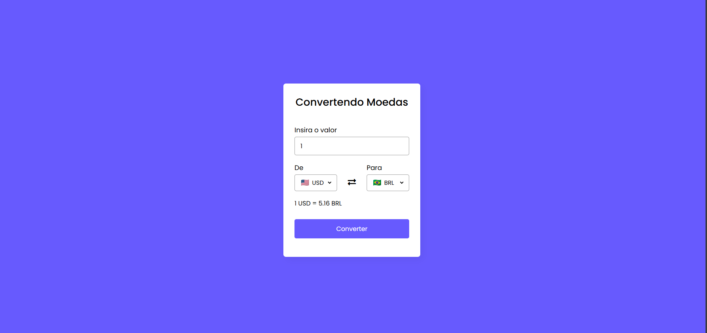

# 💱 Currency Converter

A full-stack web application that converts currencies in real time using an external exchange rate API.

This project was built to practice **full-stack development** using JavaScript, Node.js and ASP.NET Core.

---

## 📸 Project Preview

---

## 🚀 Technologies Used

Frontend
- HTML
- CSS
- JavaScript

Backend
- ASP.NET Core (C#)

Server
- Node.js
- Express

External API
- ExchangeRate API

---

## ⚙️ How to Run the Project

### 1 Clone the repository

git clone https://github.com/L4udrup/conversor-de-moedas.git

---

### 2 Configure the API Key

Inside the **Conversor-API** folder you will find a file called:

.env.example

Rename this file to: .env

Then replace the value with your own API key:

EXCHANGE_API_KEY=YOUR_API_KEY_HERE

---

### 3 Run the ASP.NET API

Go to the API folder: cd Conversor-API

Run: dotnet run

The API will run on: http://localhost:5006

---

### 4 Run the Node.js server

Open another terminal in the project root and run: node app.js

The website will be available at: http://localhost:3000

---

## 📂 Project Structure

conversor-de-moedas
│
├── Conversor-API
│
├── public
│
├── screenshot.png
│
├── app.js
│
├── README.md
│
└── .gitignore

---

## 📌 Features

- Real time currency conversion
- External API integration
- Currency flag display
- Swap currency functionality
- Full-stack architecture

---

## 👨‍💻 Author

Bryan Almeida